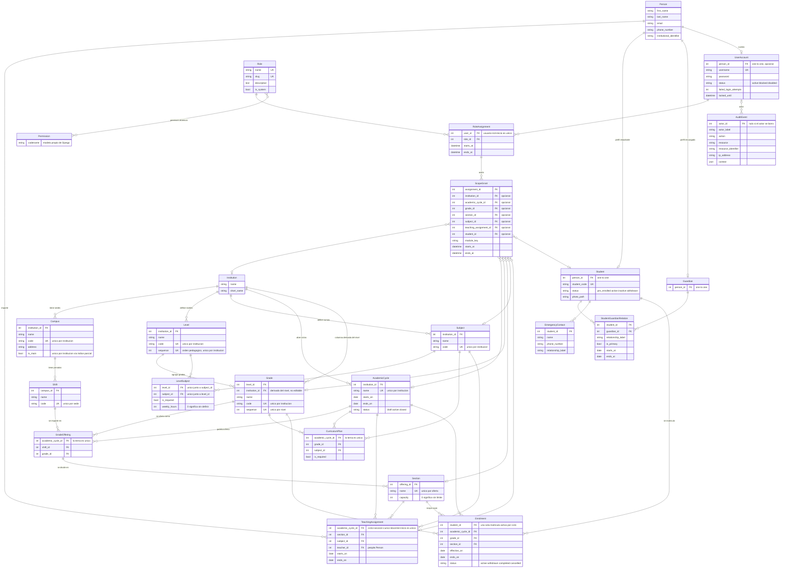
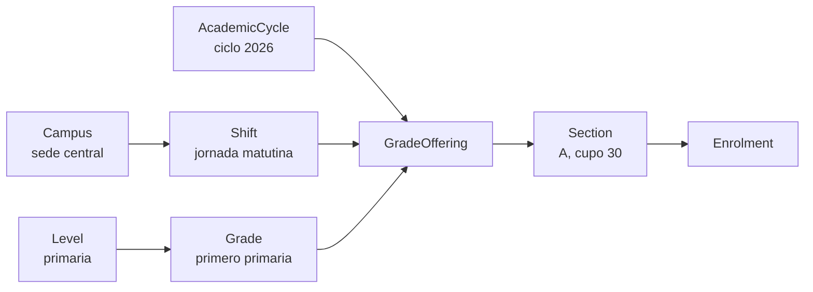

# Modelo de datos implementado

Diagrama de las tablas que existen hoy en el codigo. Refleja los modelos de
`backend/apps/*/models.py` y las migraciones aplicadas hasta
`academics/0004_grade_institution_uniqueness`, no el modelo objetivo completo:
para ese, ver `initial-data-model.md`.

## Campos heredados

Todas las tablas salvo `UserAccount` heredan de `TimeStampedModel`
(`apps/common/models.py`) y por eso comparten cuatro columnas que **no se
repiten en el diagrama**:

| Columna | Tipo | Uso |
| --- | --- | --- |
| `public_id` | UUID unico | Identificador opaco hacia el cliente; los `id` internos no se exponen |
| `created_at` | datetime | Alta del registro |
| `updated_at` | datetime | Ultima modificacion |
| `is_active` | bool | Desactivacion en lugar de borrado (RF-EST-012, ADR-0006) |

`UserAccount` extiende `AbstractUser` de Django, asi que trae `username`,
`password`, `email`, `is_active`, `is_staff` y `is_superuser`.

## Diagrama completo

## El camino que importa

La matricula no se asigna a un grado suelto: se asigna a una seccion, y esa
seccion cuelga de una oferta que ya fija ciclo, jornada, sede y grado.

`Section` no guarda ciclo, grado ni jornada: los expone como propiedades de su
oferta. Por eso no existe forma de crear una seccion cuyo grado contradiga su
ciclo. `Enrolment` si guarda `grade` y `academic_cycle` de forma redundante, y
el servicio rechaza cualquier matricula donde esos tres no concuerden con la
oferta de la seccion.

## Notas sobre relaciones que no se ven en el diagrama

- **`Grade.institution` es una copia deliberada** de `level.institution`. Un
  indice unico no puede abarcar un join, y sin esa columna la unicidad del
  codigo de grado en toda la institucion solo podria comprobarse en Python. Una
  clave foranea compuesta `(level_id, institution_id)` contra
  `Level (id, institution_id)` impide que la copia se desvie.
- **`Subject.levels`** es un many-to-many hacia `Level` a traves de
  `LevelSubject`; el diagrama muestra la tabla intermedia porque lleva datos
  propios (`is_required`, `weekly_hours`).
- **`CurriculumPlan` y `LevelSubject` se solapan** y todavia no estan
  reconciliados: el primero es el plan por ciclo y grado (RF-EST-005), el
  segundo el catalogo de cursos del nivel. Ver PD-012.
- **`ScopeGrant` no esta en uso todavia.** Los endpoints del catalogo solo
  exigen sesion; la autorizacion por permiso y alcance es PD-013.
- **`AuditEvent` es inmutable**: el modelo bloquea `save` sobre un registro
  existente y `delete`.
- `TeachingAssignment` y `CurriculumPlan` existen desde la fundacion pero aun
  no tienen servicios ni API.
