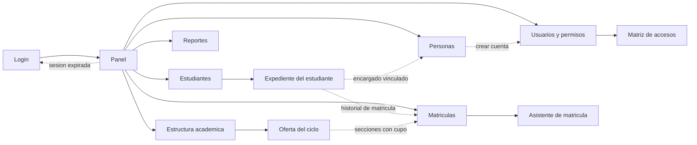

# Mapa de navegacion

Mapa de pantallas de SIGA-INEBI: desde donde se entra, como se navega entre
modulos y que ve cada tipo de usuario.

Version navegable: [`prototipo-siga.html`](prototipo-siga.html), pantalla
`#/mapa`.

## Principios de navegacion

- Un unico punto de entrada publico: `Login`. Cualquier ruta privada sin sesion
  valida redirige alli y conserva el destino para volver despues de autenticar.
- El `Panel` es el nodo de reparto. Desde el se alcanza cualquier modulo en un
  clic.
- Ninguna pantalla queda a mas de tres niveles del `Panel`: modulo, detalle y,
  como maximo, asistente.
- La barra lateral de modulos esta siempre visible y se recorta por rol.
- Denegacion por defecto: si el rol no tiene el modulo, este no aparece en el
  menu y la ruta directa muestra `Acceso denegado`.

## Diagrama

## Rutas

| Pantalla | Ruta prototipo | Ruta app real | Nivel |
| --- | --- | --- | --- |
| Login | `#/login` | `/login` | 0 |
| Panel | `#/app` | `/app` | 1 |
| Estudiantes | `#/estudiantes` | `/app/estudiantes` | 2 |
| Expediente del estudiante | `#/estudiantes/expediente` | `/app/estudiantes/:id` | 3 |
| Personas | `#/personas` | `/app/personas` | 2 |
| Estructura academica | `#/academico` | `/app/sedes`, `/app/niveles`, `/app/cursos`, `/app/ciclos` | 2 |
| Oferta del ciclo | `#/academico/oferta` | `/app/ofertas/:offeringId` | 3 |
| Matriculas | `#/matriculas` | `/app/matriculas` | 2 |
| Asistente de matricula | `#/matriculas/nueva` | `/app/matriculas/nueva` | 3 |
| Reportes | `#/reportes` | `/app/reportes` | 2 |
| Usuarios y permisos | `#/usuarios` | `/app/usuarios` | 2 |
| Matriz de accesos | `#/permisos` | `/app/usuarios/permisos` | 3 |

Las rutas de `Sedes`, `Niveles`, `Cursos` y `Ciclos` ya existen en
`frontend/src/routes/AppRoutes.jsx`. El prototipo las agrupa bajo un solo
modulo `Estructura academica` porque comparten el mismo patron de uso; si la
institucion prefiere verlas separadas en el menu, es un cambio de agrupacion,
no de pantallas.

## Saltos entre modulos

Son los atajos que evitan que el usuario vuelva al panel para continuar una
tarea:

| Desde | Hacia | Motivo |
| --- | --- | --- |
| Expediente | Matriculas | Consultar o corregir la matricula del ciclo |
| Expediente | Personas | Abrir la ficha del encargado vinculado |
| Personas | Usuarios | Crear la cuenta de una persona ya registrada |
| Oferta del ciclo | Matriculas | Matricular sobre una seccion con cupo |

## Visibilidad por rol

Roles tomados de `docs/architecture/authorization-model.md`. `Si` significa que
el modulo aparece en el menu; el detalle de que se puede editar dentro esta en
la columna de notas.

| Modulo | Admin | Director | Coordinador | Administrativo | Docente | Encargado |
| --- | --- | --- | --- | --- | --- | --- |
| Panel | Si | Si | Si | Si | Si | Si |
| Estudiantes | Si | Si | Si | Si | Si | Si |
| Personas | Si | Si | — | Si | — | — |
| Estructura academica | Si | Si | Si | — | — | — |
| Matriculas | Si | Si | Si | Si | — | — |
| Reportes | Si | Si | Si | — | Si | — |
| Usuarios y permisos | Si | — | — | — | — | — |

| Rol | Alcance | Notas |
| --- | --- | --- |
| Administrador del sistema | Institucion completa | Ve y edita todo, incluidas cuentas, roles y bitacora. |
| Director | Institucion completa | Lectura total y aprobaciones. No administra cuentas ni permisos. |
| Coordinador academico | Ciclo escolar vigente | Edita estructura y matricula del ciclo activo. Sin datos sensibles de salud. |
| Personal administrativo | Ciclo escolar vigente | Captura expedientes y matricula. Estructura academica solo lectura. |
| Docente | Secciones asignadas | Solo estudiantes de sus secciones en el ciclo vigente. |
| Encargado o tutor | Estudiantes vinculados | Portal de consulta, solo lectura. El modulo se rotula `Mis estudiantes`. |

Ver el modulo no equivale a poder editarlo. Dentro de cada pantalla el rol
decide que botones aparecen: el prototipo lo demuestra ocultando `Nuevo
estudiante` para docente y encargado, y las acciones de edicion de estructura
para el personal administrativo.

## Estados de navegacion previstos

- **Sesion expirada**: cualquier pantalla vuelve a `Login` con aviso y recuerda
  el destino.
- **Acceso denegado**: ruta valida pero fuera del alcance del rol. Se explica el
  motivo y se ofrece volver al panel.
- **Pantalla no encontrada**: ruta inexistente, con retorno al panel.
- **Asistente abierto**: `Nueva matricula` es la unica pantalla que restringe la
  navegacion mientras esta en curso; cancelar no deja registros a medias.

## Entregables relacionados

| Entregable | Archivo |
| --- | --- |
| Indice del bloque de diseno | [README.md](README.md) |
| Wireframes | [wireframes.md](wireframes.md) |
| Prototipo navegable | [prototipo-siga.html](prototipo-siga.html) |
| Guia de validacion | [prototype-validation.md](prototype-validation.md) |
| Bitacora de observaciones | [validation-observations.md](validation-observations.md) |
