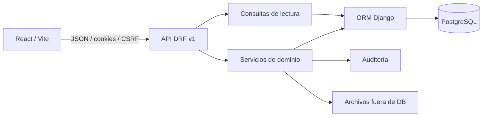
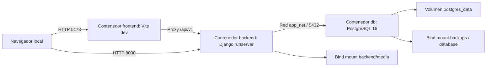

# Manual técnico de SIGA-INEBI

Estado: borrador de Fase 7, preparado el 2026-10-08. Responsabilidad: Daniel,
con aportes del equipo. La validación contra el SHA final y la revisión
independiente están pendientes; este documento no certifica una entrega.

## 1. Arquitectura y alcance

SIGA-INEBI reúne identidad institucional, estructura académica, estudiantes,
matrícula, asistencia, evaluación, documentos y auditoría. El alcance funcional
y las exclusiones se consultan en [alcance fundacional](../requirements/functional-scope.md)
y el estado verificable de cada RF/RNF en [trazabilidad](../requirements/traceability-matrix.md).
La existencia de un módulo no implica aceptación de todos sus requisitos.

El monorepo conserva `backend/`, `frontend/`, `docs/`, `scripts/` y
`.github/workflows/`. El backend es un monolito modular: una aplicación Django
con apps por dominio y una base PostgreSQL. Los binarios se guardan fuera de
la base, con metadatos y referencias en ella.

Las dependencias se describen en [mapa de dominios](../architecture/domain-map.md).
Las apps actuales incluyen `people`, `identity`, `students`, `academics`,
`teachers`, `enrolments`, `attendance`, `evaluation`, `documents`, `audit`,
`reporting` y `common`. Personas e identidad sustentan cuentas y expedientes;
estructura/ciclo y matrícula sustentan asistencia y evaluación. Auditoría y
almacenamiento sirven transversalmente a los dominios. Las políticas compartidas
de ciclo gobiernan las escrituras sin trasladar reglas a componentes web.

### Despliegue que existe en el repositorio

`compose.yml` más `compose.override.yml` levantan desarrollo, migraciones al
arranque y datos demo. El override publica también PostgreSQL en el puerto 5432.
`compose.test.yml` agrega `db-test` en tmpfs y `backend-test` con configuración
de pruebas. No hay perfil Compose de producción ni proxy TLS en estos archivos.
GitHub Actions valida y construye; no constituye un pipeline de despliegue.

## 2. Tecnologías y decisiones

| Decisión | Consecuencia técnica y fuente |
| --- | --- |
| Monorepo | Cambios coordinados de API, UI, pruebas y documentación; [ADR-0001](../decisions/ADR-0001-monorepository.md). |
| Monolito modular | Apps cohesionadas por dominio sin infraestructura de microservicios; [ADR-0002](../decisions/ADR-0002-modular-monolith.md). |
| PostgreSQL / ORM | PostgreSQL obligatorio en pruebas y validación final; SQLite solo desarrollo rápido; [ADR-0003](../decisions/ADR-0003-database-strategy.md). |
| React/Vite + DRF | Interfaz web y API JSON separadas; [ADR-0004](../decisions/ADR-0004-rest-api.md). |
| Sesión y autorización | Cookies, permisos atómicos y alcance; [ADR-0005](../decisions/ADR-0005-authentication-and-authorization.md). |
| Historia | Estados, vigencias y baja lógica; [ADR-0006](../decisions/ADR-0006-soft-delete-and-history.md). |
| Entornos | Docker reproducible y alternativa local; [ADR-0007](../decisions/ADR-0007-docker-and-local-environments.md). |
| Capas | Transporte, consultas y servicios independientes; [ADR-0008](../decisions/ADR-0008-application-layer-boundaries.md). |
| Procesamiento diferido | Sin worker ni cola; operaciones actuales síncronas y acotadas, RNF-REN-003 diferido; [ADR-0009](../decisions/ADR-0009-deferred-background-processing.md). |

Las imágenes y CI usan Python 3.11, Node 22 y PostgreSQL 16. Dependencias exactas
en `backend/requirements/` y `frontend/package-lock.json`. Docker y GitHub Actions
repiten controles sobre esas versiones; sus resultados deben asociarse a una
corrida y un SHA, no inferirse de la mera presencia de configuración.

## 3. Backend, API y frontend

Vistas y serializadores traducen HTTP; `queries.py` reúne lecturas ORM y
`services.py` coordina reglas, transacciones y auditoría. Las pruebas
`backend/tests/unit/test_application_boundaries.py` protegen estos límites.
No añadir reglas de negocio a vistas, serializadores ni componentes React.

La API usa `/api/v1/`, recursos JSON y fechas ISO 8601. Consultar los contratos
en [convenciones API](../architecture/api-conventions.md). El manejador
`backend/config/api/exception_handler.py` traduce errores de dominio a 400,
ausencia a 404 y autorización a 403, con sobre
`{"error":{"status_code":400,"detail":"..."}}`. Algunos endpoints producen
respuestas propias; el cliente admite también errores por campo y mensajes
directos. No presumir que toda respuesta JSON tiene un sobre uniforme.

`frontend/src/app/routes.jsx` protege rutas privadas mientras resuelve la sesión
y redirige a `/login` cuando falta. `AuthProvider` consulta `/auth/me/` y conserva
el usuario en estado React. `shared/api/apiClient.js` envía cookies con
`credentials: "include"` y CSRF en operaciones de escritura. No persiste tokens
de autenticación en localStorage; la preferencia visual del tema sí puede persistir.
La autorización efectiva sigue en backend: una ruta visible no concede permiso.

La UI agrupa pantallas de ciclos, estructura académica, docentes, estudiantes,
cuentas, matrícula, asistencia, evaluación y documentos. El registro de navegación
en `frontend/src/app/navigation.js` determina rutas y carga diferida por módulo.

## 4. Seguridad, archivos y auditoría

El [modelo de autorización](../architecture/authorization-model.md) regula
cuenta vinculada a persona, roles múltiples y permisos con alcance obligatorio.
El resolvedor central de `apps.identity.scopes` aplica alcance a objetos y
listados. Los rechazos y lecturas sensibles se auditan según su requisito;
los contenidos sensibles y credenciales no se copian a la bitácora.
Consultar [auditoría](../architecture/audit-strategy.md) y
[clasificación de datos](../architecture/data-classification.md).

Producción debe usar HTTPS y configuración de producción; cookies seguras no
demuestran que haya TLS instalado. `config.settings.production` exige PostgreSQL,
desactiva debug y fija cookies Secure. El Compose de desarrollo permite HTTP y
cookies no Secure; no es una receta para publicar la aplicación.
La guía [despliegue seguro](../development/secure-deployment.md) indica los
requisitos del proxy. Cámara en teléfono requiere contexto seguro y permiso
del navegador; probarla por HTTPS antes de aceptar QR.

Los archivos usan referencias, hashes y controles de acceso; ver
[almacenamiento](../architecture/file-storage-strategy.md). No publicar `media/`
como directorio abierto. `.env`, respaldos, secretos y datos reales permanecen
fuera de Git y de los logs de pruebas. Los artefactos de Fase 7 usan datos sintéticos.

## 5. Base de datos y calidad

El [modelo inicial](../architecture/initial-data-model.md) explica las entidades
conceptuales; [estrategia DB](../architecture/database-strategy.md) documenta
persistencia. El modelo lógico implementado vive en `backend/apps/*/models.py`
y el físico versionado en sus migraciones. Ver
[procedimiento de migraciones](../development/database-migrations.md).

El ER final, inventario físico y diccionario final aún requieren el producto de
Diana, siguiendo [instrucciones de diccionario](05-final-data-dictionary-instructions.md).
Los scripts finales requieren el producto de Josué, siguiendo
[instrucciones DB](06-final-database-scripts-instructions.md). El modelo inicial
no se presenta como ER final. Estos entregables y su correspondencia con el SHA
final son condiciones pendientes para cerrar este manual.

Pruebas backend: unitarias, integración, API, permisos y migraciones sobre
PostgreSQL; frontend: Vitest y componentes. Los umbrales son 70 % backend y
60 % frontend: [estrategia de pruebas](../development/testing-strategy.md).
CI ejecuta Ruff, formato, migraciones pendientes, Pytest, Bandit, pip-audit,
ESLint, Prettier, Vitest, build frontend e integración Docker. Las excepciones de
pip-audit configuradas deben constar en el informe de seguridad y revisarse;
aprobar ese comando no equivale a ausencia de vulnerabilidades.

Seguir [flujo Git](../development/git-workflow.md),
[Definition of Done](../development/definition-of-done.md) y
[proceso de release](../development/release-process.md). Cada requisito
implementado exige pruebas y trazabilidad; un manual o build no concede aceptación.

## 6. Operación y validación del manual

La ruta reproducible y los controles Docker se describen en
[instalación](03-installation-and-configuration.md). Los respaldos, simulacros
y límites de recuperación se describen en [plan de respaldo](09-final-backup-and-recovery-plan.md).
No ejecutar restauraciones genéricas sobre el entorno que contiene trabajo vigente.

- [ ] Josué instala desde copia limpia y registra SHA, versiones y resultados.
- [ ] Incorporar ER, diccionario y scripts finales validados.
- [ ] Vincular corrida final de CI, cobertura y seguridad del mismo SHA.
- [ ] Revisor independiente confirma diagramas, comandos y configuración.

Evidencias y estado de cierre en [expediente Fase 7](../quality/fase-7/README.md)
y [seguimiento de manuales](../quality/fase-7/seguimiento-manuales.md).
