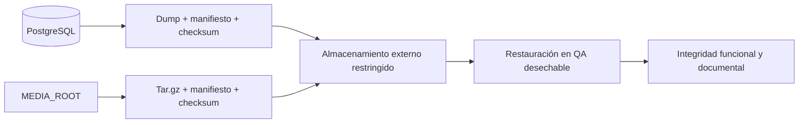

# Plan de respaldo y recuperación de SIGA-INEBI

Estado: borrador de Fase 7, 2026-10-08. Daniel y Roí ejecutan y documentan;
Pablo coordina la confirmación institucional y un revisor independiente valida.
Las metas y procedimientos provienen de [respaldo y recuperación](../architecture/backup-and-recovery.md).
La evidencia de una corrida y el SHA final son obligatorios para cerrar el plan.

## 1. Activos y política

| Activo | Protección y responsable |
| --- | --- |
| PostgreSQL | Pila `database`: dump custom, manifiesto y SHA-256; Daniel/Roí. |
| Adjuntos/documentos | Pila `files`: archivo tar.gz de `MEDIA_ROOT`, manifiesto y SHA-256; Daniel/Roí. |
| Configuración y secretos | Copia restringida en gestor externo de secretos/configuración; responsable institucional de infraestructura por confirmar. No incluidos en los dumps. |
| Código y documentación | Git remoto y copia de release identificada por SHA/checksums; Daniel prepara, Pablo consolida. |

Base y archivos se respaldan y restauran por separado. Restaurar solo base puede
dejar documentos `missing`; restaurar solo archivos puede dejar binarios sin
referencia. La integridad y la correspondencia temporal de ambas pilas deben
verificarse antes de reabrir el servicio. Ver [almacenamiento](../architecture/file-storage-strategy.md).



| Política | Referencia operativa y estado |
| --- | --- |
| Frecuencia | Ambas pilas diariamente fuera de jornada; comprobar frescura después. Scheduler institucional pendiente, no lo instala `make backup`. |
| RPO | 24 horas, `RECOVERY_POINT_OBJECTIVE_HOURS`; referencia pendiente de confirmación institucional. |
| RTO | 4 horas, `RECOVERY_TIME_OBJECTIVE_HOURS`; referencia pendiente de confirmación institucional. |
| Retención | Propuesta: 7 diarios y 4 semanales por pila. Pendiente de aprobación y automatización; scripts actuales no rotan. No borrar historia auditable por esta política. |
| Ubicación | `BACKUP_ROOT` fuera del host de aplicación. `./backups` solo es destino local de desarrollo/QA. Destino institucional pendiente. |
| Cifrado/acceso | Cifrado en reposo y transporte en almacenamiento institucional; acceso exclusivo a operadores autorizados. Los scripts generan artefactos sin cifrado propio: configuración externa pendiente. |
| Simulacros | Antes de entrega y al menos una vez por ciclo, con volumen representativo y destinos desechables. |

Los manifiestos registran creación UTC, tamaño y SHA-256; base añade versión
del cliente, archivos su origen e inventario. SHA-256 detecta alteraciones pero
no reemplaza cifrado ni control de acceso. Mantener artefactos y manifiestos juntos.

## 2. Respaldar y comprobar

Desde la instalación QA aislada del [manual de instalación](03-installation-and-configuration.md):

```sh
make backup-database
make backup-files
docker compose exec backend python manage.py check_backup_freshness
```

`make backup` ejecuta ambas pilas consecutivamente. PostgreSQL 16 se respalda
con cliente de su contenedor, evitando divergencia de versión mayor. Comprobar
que cada comando termina con código cero y existen artefacto y manifiesto por
pila bajo `BACKUP_ROOT`. El script de archivos necesita `tar`, `sha256sum` y
las herramientas declaradas en `scripts/backup/common.sh` del host.
El comando de frescura compara cada pila con el RPO por separado y registra
`TaskRun`; ausencia de respaldo o antigüedad excesiva son fallos. `make backup-check`
usa la `.venv` local y conexión predeterminada del Makefile; el comando Docker
anterior evita depender de ella en una instalación Docker.

Copiar ambas pilas al almacenamiento externo autorizado, verificar SHA-256
también en destino y registrar solo metadatos no sensibles. No incluir dumps,
manifiestos con rutas sensibles, secretos ni archivos reales en Git.

## 3. Recuperación controlada

1. Aislar el incidente, detener escrituras y registrar inicio de indisponibilidad.
   Conservar evidencia y estado previo; no borrar historia ni restaurar por ensayo
   sobre la instancia activa.
2. Elegir pilas y respaldos compatibles con el instante requerido. Verificar
   manifiestos, SHA-256 y PostgreSQL 16; recuperar configuración y secretos desde
   su gestor externo. Los scripts de restore verifican checksum antes de escribir.
3. Preparar destino aislado y confirmar sus nombres/rutas. Probar primero ahí.
   `restore-database.sh` usa `--clean --if-exists` y reemplaza objetos del destino;
   `restore-files.sh` extrae sin borrar archivos adicionales existentes. Usar
   directorio vacío si se necesita recuperar exactamente el conjunto respaldado.
4. Restaurar las pilas elegidas con los scripts oficiales y registrar códigos
   de salida. En la instalación QA completamente desechable, los comandos
   `make restore-database` y `make restore-files` restauran el respaldo más
   reciente en su base y `backend/media`; confirmar ese alcance antes de usarlos.
5. Verificar esquema y documentos, luego login, lectura de expediente, matrícula
   y descarga autorizada de un documento sintético; comparar inventario, relaciones
   y checksums con la línea base previa al respaldo.
6. Registrar tiempo hasta recuperación funcional, pérdidas observadas y medidas
   preventivas; decidir reapertura con el responsable institucional.

Comprobaciones en el backend conectado al destino recuperado:

```sh
python manage.py check
python manage.py migrate --check
python manage.py check_document_storage_integrity
```

El último comando debe confirmar archivos presentes y hashes correctos.
Comprobar explícitamente que restaurar una pila conserva intacta la otra.
El servicio no queda validado por la sola finalización de `pg_restore` o `tar`.

## 4. Simulacro y evidencia

```sh
make recovery-drill
```

El target usa `${DATABASE_NAME}_drill` y `/tmp/siga-drill-media` dentro de un
contenedor backend temporal, que proporciona Python 3 y cliente PostgreSQL 16.
Construir previamente la imagen backend y mantener `db` saludable: el target
usa `--no-deps` y no inicia la base. Monta scripts y respaldos en modo lectura.
El script requiere `python3` para validar los manifiestos antes de reemplazar
la base desechable. El destino de archivos del simulacro no es `backend/media`.
Antes de repetir, verificar que esos recursos son desechables y que la base
termina en `_drill` y difiere de la base origen. Registrar la restauración
cronometrada, pero medir además el tiempo de verificaciones y reapertura: el
cronómetro del script cubre solo la restauración, no todo el incidente.
El contenedor se elimina al terminar (`--rm`), incluido su directorio temporal
de archivos. Para validar integridad documental, ejecutar las comprobaciones
en ese mismo contenedor antes de eliminarlo o repetir la restauración con un
directorio desechable persistente. Las verificaciones Django deben conectarse
a la base recuperada y usar el directorio recuperado correspondiente; el backend normal sigue
conectado al origen y no acredita la integridad del simulacro.

La corrida debe registrar fecha, responsable, SHA, entorno, volumen por pila,
inventario sintético, selección de respaldo, edad/RPO, duración/RTO, códigos de
salida, integridad y prueba de independencia. Vincularla desde
[ejecuciones](../quality/fase-7/ejecuciones.csv) y el
[informe de recuperación](../quality/fase-7/informe-recuperacion.md).
Una medición histórica con esquema vacío no representa un ciclo escolar real.

- [ ] Simulacro documentado sobre recursos desechables y volumen declarado.
- [ ] Artefacto alterado rechazado antes de escribir; destino original intacto.
- [ ] Integridad funcional/documental e independencia comprobadas.
- [ ] RPO/RTO, retención, destino externo, cifrado y operadores confirmados.
- [ ] Revisor independiente reproduce procedimientos contra el SHA final.

Hasta cerrar estos puntos el plan permanece como borrador; la aceptación
institucional se registra por separado en el expediente de Fase 7.
