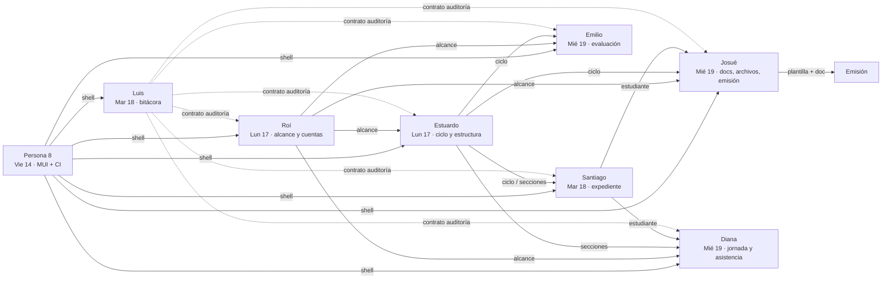
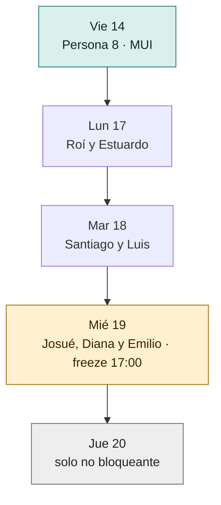
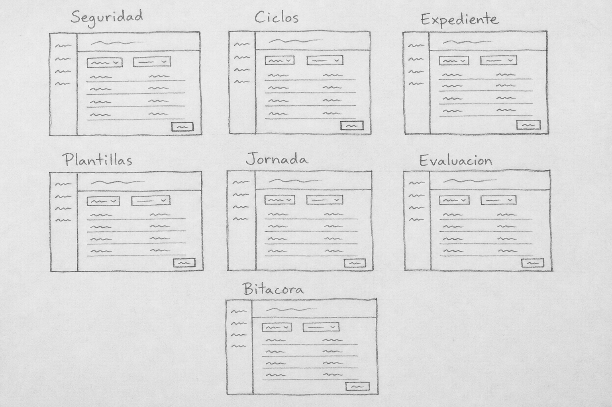
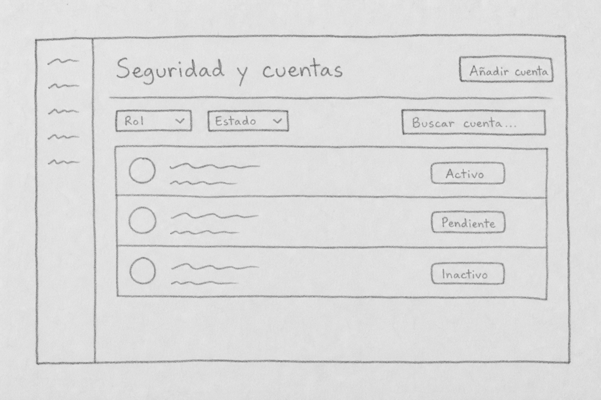
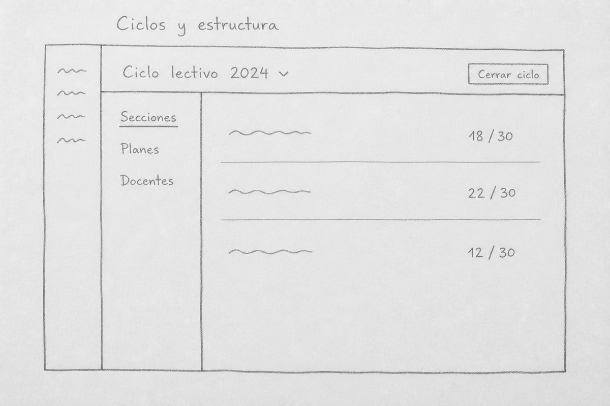
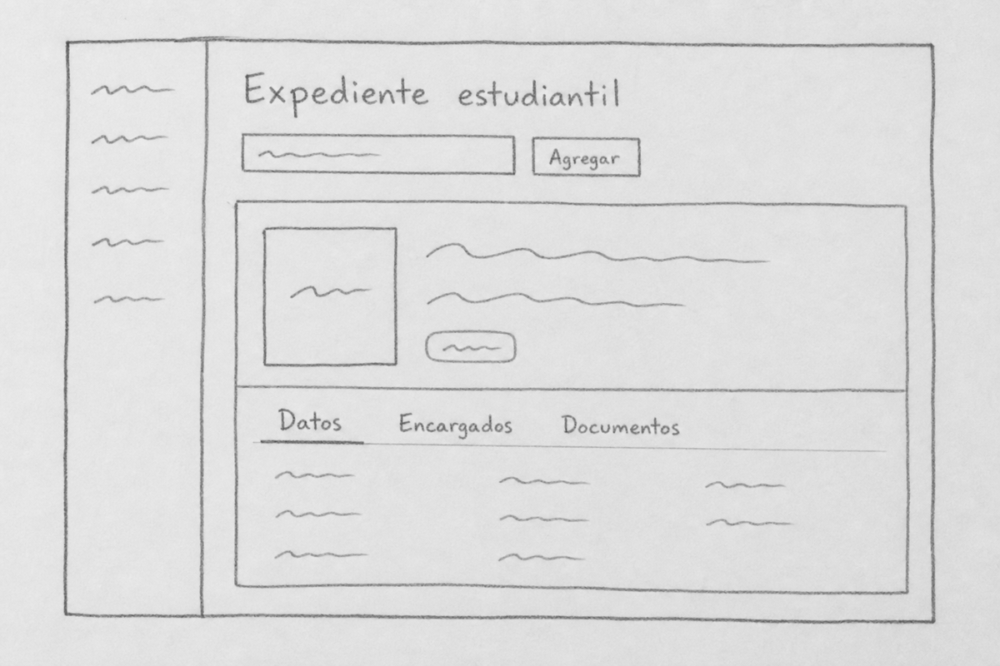
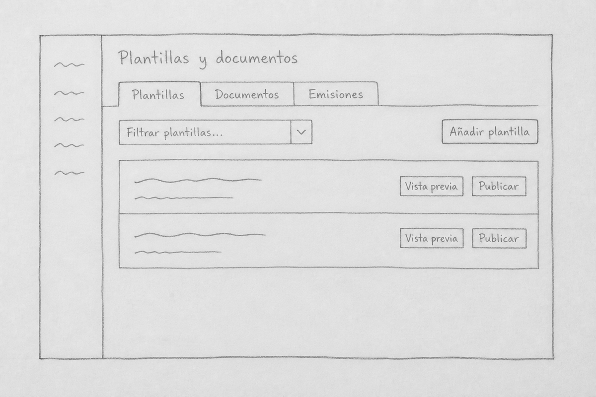
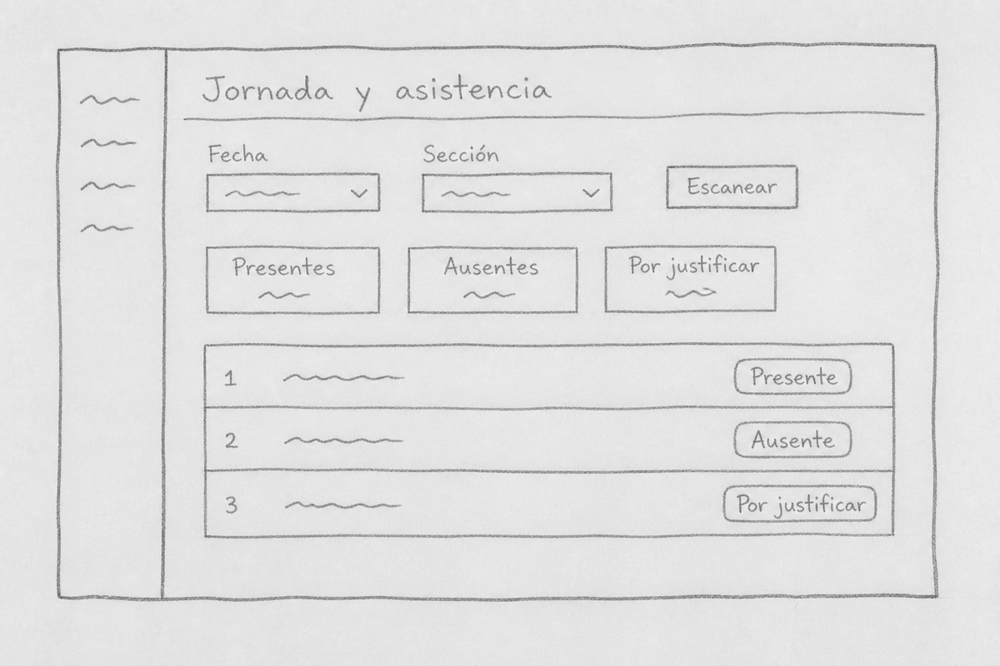
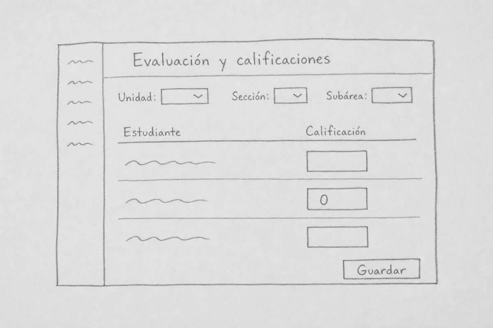
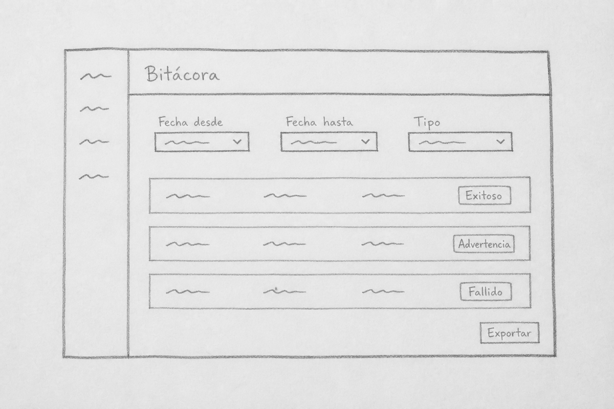

# Sprint full-stack — 14 al 20 de agosto de 2026

Este sprint entrega capacidades verticales: quien toma un carril implementa backend, frontend y
pruebas del mismo dominio. Cada carril tiene **un día de entrega** en el que debe quedar mergeado
en `develop`. Hasta ese día, la persona trabaja con autonomía (rama propia, ritmo propio, drafts
opcionales). El jueves 20 queda reservado para trabajo que no bloquea a nadie.

> Los wireframes de este documento son una propuesta de interacción, no un contrato visual. Deben
> reutilizar el sistema de diseño de la PR
> [#346](https://github.com/siga-inebi/siga-inebi/pull/346).

## Resultado esperado

Al finalizar el miércoles 19:

- la base MUI está integrada y cada carril entrega una experiencia completa contra el API real;
- ciclo y estructura habilitan los flujos dependientes de asistencia, evaluación y emisión;
- expediente permite consultar al estudiante y sus relaciones institucionales;
- plantillas y documentos cubren el flujo mínimo previo a una emisión;
- jornada, evaluación y bitácora exponen sus flujos principales;
- ningún cambio bloqueante queda únicamente en una rama o PR abierta.

## Acuerdos de trabajo

| Tema | Acuerdo |
|---|---|
| Propiedad | Una persona es responsable de backend, frontend, pruebas y trazabilidad de su carril. |
| Autonomía | Hasta el día de entrega no hay obligación de PR diaria. Cada quien organiza el trabajo del carril. |
| Día de entrega | “Entregado” significa mergeado en `develop` ese día, no solamente con PR abierta. |
| Tamaño de PR | Límite suave de 1000 líneas autoradas; no cuentan lockfiles, código generado ni snapshots. |
| Cohesión | Un PR cubre un RF o un grupo estrechamente relacionado del mismo dominio. |
| Corte vertical | Si backend y frontend no caben juntos, el mismo responsable abre 1–3 PR encadenadas **el día de entrega**. |
| Drafts | Se permiten draft PRs antes del día de entrega para pedir feedback; no desbloquean a nadie. |
| Revisión | Quien ya entregó revisa a quien entrega ese día (tabla abajo). |
| Alerta | Si el día de entrega está en riesgo, se reporta **ese día antes de las 12:00** con enlace a PR y alcance pendiente. |
| Jueves 20 | Solo pruebas, RNF, documentación, trazabilidad, accesibilidad y tareas sin consumidores bloqueados. |

Antes de implementar un issue con `status:in-progress`, se compara el criterio de aceptación contra
el código actual. Esa etiqueta indica que existe base técnica; no implica que todo deba
reimplementarse.

## Responsabilidades

| Carril | Persona | Propiedad full-stack | Día de entrega |
|---|---|---|---|
| Plataforma | Persona 8 | Base MUI, integración, CI, rendimiento y accesibilidad | **Vie 14** |
| Seguridad | Roí | Alcances, autenticación, cuentas y sus pantallas | **Lun 17** |
| Académico | Estuardo | Ciclo, secciones, cupos, asignaciones y sus pantallas | **Lun 17** |
| Expediente | Santiago | Estudiantes, encargados, contactos y sus pantallas | **Mar 18** |
| Bitácora | Luis | Auditoría, consultas restringidas y su pantalla | **Mar 18** |
| Documental | Josué | Plantillas, documentos, archivos, emisión y sus pantallas (carril ampliado) | **Mié 19** |
| Asistencia | Diana | Jornada, captura, presencia y sus pantallas | **Mié 19** |
| Evaluación | Emilio | Calificaciones, resultados y sus pantallas | **Mié 19** |

### Quién revisa a quién el día de entrega

| Día | Entrega | Revisan |
|---|---|---|
| Vie 14 | Persona 8 | Cualquier otra persona disponible |
| Lun 17 | Roí y Estuardo | Persona 8 (+ quien ya tenga context de identity/academics) |
| Mar 18 | Santiago y Luis | Roí y Estuardo |
| Mié 19 | Josué, Diana y Emilio | Roí, Estuardo y Persona 8 |

## Calendario de entrega

No hay entrega diaria para todos. Cada fila es el **único día obligatorio de merge** de ese carril
para el trabajo bloqueante.

### Viernes 14 — Persona 8 (desbloquea a todos)

**Entrega en `develop`:**

- Revisar e integrar [PR #346](https://github.com/siga-inebi/siga-inebi/pull/346).
- Dejar publicado el shell MUI, componentes reutilizables y checklist visual.
- CI verde sobre `develop` después del merge.

Hasta el viernes, las demás personas pueden hacer gap analysis y trabajar backend en su rama; no
crean un look alternativo al de #346.

**Josué (adelanto, sin día de merge obligatorio aún):** puede empezar ya el paquete autónomo de
archivos y documentos listado más abajo. No espera al miércoles para codear; el miércoles es su
día de merge del corte oficial.

### Lunes 17 — Roí y Estuardo (desbloquean al resto)

**Roí — merge del carril completo:**

- [#73 RF-ALC-005](https://github.com/siga-inebi/siga-inebi/issues/73)
- [#106 RF-AUT-002](https://github.com/siga-inebi/siga-inebi/issues/106)
- [#110 RF-AUT-006](https://github.com/siga-inebi/siga-inebi/issues/110)
- [#142 RF-CTA-004](https://github.com/siga-inebi/siga-inebi/issues/142)
- [#144 RF-CTA-006](https://github.com/siga-inebi/siga-inebi/issues/144)
- [#145 RF-CTA-007](https://github.com/siga-inebi/siga-inebi/issues/145)
- Pantallas de cuenta, bloqueo, cambio de contraseña y desactivación.

**Estuardo — merge del carril completo:**

- [#129 RF-CIC-004](https://github.com/siga-inebi/siga-inebi/issues/129)
- [#171 RF-EST-007](https://github.com/siga-inebi/siga-inebi/issues/171)
- [#175 RF-EST-011](https://github.com/siga-inebi/siga-inebi/issues/175)
- [#172 RF-EST-008](https://github.com/siga-inebi/siga-inebi/issues/172)
- [#173 RF-EST-009](https://github.com/siga-inebi/siga-inebi/issues/173)
- [#169 RF-EST-005](https://github.com/siga-inebi/siga-inebi/issues/169) o [#174 RF-EST-010](https://github.com/siga-inebi/siga-inebi/issues/174) (el que desbloquee activación real)
- Pantallas de ciclo, secciones, cupo y asignaciones.

Si el volumen no cabe en PRs ≤ 1000, se parten el mismo lunes; no se deja para martes lo que desbloquea.

### Martes 18 — Santiago y Luis

**Santiago — merge del carril completo:**

- [#185 RF-EXP-001](https://github.com/siga-inebi/siga-inebi/issues/185) registro del estudiante
- [#186 RF-EXP-002](https://github.com/siga-inebi/siga-inebi/issues/186) código estudiantil
- [#187 RF-EXP-003](https://github.com/siga-inebi/siga-inebi/issues/187) estado del estudiante
- [#188 RF-EXP-004](https://github.com/siga-inebi/siga-inebi/issues/188) vínculo con encargados
- [#189 RF-EXP-005](https://github.com/siga-inebi/siga-inebi/issues/189) contactos de emergencia
- [#191 RF-EXP-007](https://github.com/siga-inebi/siga-inebi/issues/191) fotografía del estudiante
- [#192 RF-EXP-008](https://github.com/siga-inebi/siga-inebi/issues/192) conservación del expediente
- Pantallas de alta, consulta, encargados, contactos y foto.

**Luis — merge del carril completo:**

- [#111 RF-BIT-001](https://github.com/siga-inebi/siga-inebi/issues/111)
- [#112 RF-BIT-002](https://github.com/siga-inebi/siga-inebi/issues/112)
- [#117 RF-BIT-007](https://github.com/siga-inebi/siga-inebi/issues/117)
- [#113 RF-BIT-003](https://github.com/siga-inebi/siga-inebi/issues/113)
- [#115 RF-BIT-005](https://github.com/siga-inebi/siga-inebi/issues/115)
- [#116 RF-BIT-006](https://github.com/siga-inebi/siga-inebi/issues/116)
- Pantalla de bitácora de solo lectura + exportación restringida.
- Contrato de auditoría consumible por los demás carriles (documentado en la PR).

### Miércoles 19 — Josué, Diana y Emilio (freeze 17:00)

**Josué — carril ampliado (merge del corte oficial + lo autónomo que alcance):**

Orden de trabajo sugerido (mismo dominio; puede adelantar desde el viernes):

1. **Autónomo (vie–mar, merge cuando esté listo, idealmente antes o el mié):**
   - [#78 RF-ARC-001](https://github.com/siga-inebi/siga-inebi/issues/78) tipos de archivo admitidos
   - [#79 RF-ARC-002](https://github.com/siga-inebi/siga-inebi/issues/79) límite de tamaño y normalización
   - [#84 RF-ARC-007](https://github.com/siga-inebi/siga-inebi/issues/84) los documentos no se eliminan
   - [#148 RF-DOC-003](https://github.com/siga-inebi/siga-inebi/issues/148) requisitos documentales en matrícula
   - [#151 RF-DOC-006](https://github.com/siga-inebi/siga-inebi/issues/151) auditoría de lectura
   - [#153 RF-DOC-008](https://github.com/siga-inebi/siga-inebi/issues/153) generados no se archivan
   - [#154 RF-DOC-009](https://github.com/siga-inebi/siga-inebi/issues/154) consulta del expediente documental
   - [#155 RF-DOC-010](https://github.com/siga-inebi/siga-inebi/issues/155) conservación del vínculo
2. **Corte oficial del miércoles (obligatorio en `develop`):**
   - [#254 RF-PLA-007](https://github.com/siga-inebi/siga-inebi/issues/254)
   - [#146 RF-DOC-001](https://github.com/siga-inebi/siga-inebi/issues/146)
   - [#147 RF-DOC-002](https://github.com/siga-inebi/siga-inebi/issues/147)
   - [#149 RF-DOC-004](https://github.com/siga-inebi/siga-inebi/issues/149)
   - [#150 RF-DOC-005](https://github.com/siga-inebi/siga-inebi/issues/150)
   - [#156 RF-EMI-001](https://github.com/siga-inebi/siga-inebi/issues/156) solo si ciclo, plantilla y documento ya están en `develop`
   - Pantallas de plantillas, documentos y emisión individual
3. **Si aún avanza el miércoles:**
   - [#157 RF-EMI-002](https://github.com/siga-inebi/siga-inebi/issues/157) fecha/hora en el documento
   - [#158 RF-EMI-003](https://github.com/siga-inebi/siga-inebi/issues/158) folio correlativo

No toma issues de estructura, asistencia ni evaluación. Si se atrasa, protege primero el corte
oficial del miércoles; el paquete autónomo ARC/DOC puede seguir el jueves.

**Diana — merge del carril completo:**

- [#212 RF-JOR-008](https://github.com/siga-inebi/siga-inebi/issues/212)
- [#213 RF-JOR-009](https://github.com/siga-inebi/siga-inebi/issues/213)
- [#85 RF-ASI-001](https://github.com/siga-inebi/siga-inebi/issues/85)
- [#86 RF-ASI-002](https://github.com/siga-inebi/siga-inebi/issues/86)
- [#88 RF-ASI-004](https://github.com/siga-inebi/siga-inebi/issues/88)
- [#94 RF-ASI-010](https://github.com/siga-inebi/siga-inebi/issues/94)
- Pantallas de presencia, porcentaje y captura.

**Emilio — merge del carril completo:**

- [#118 RF-CAL-001](https://github.com/siga-inebi/siga-inebi/issues/118)
- [#119 RF-CAL-002](https://github.com/siga-inebi/siga-inebi/issues/119)
- [#120 RF-CAL-003](https://github.com/siga-inebi/siga-inebi/issues/120)
- [#123 RF-CAL-006](https://github.com/siga-inebi/siga-inebi/issues/123)
- [#255 RF-RES-001](https://github.com/siga-inebi/siga-inebi/issues/255)
- Pantallas de captura y consulta de resultado.

A las **17:00** se congela lo bloqueante: lo que no esté en `develop` pasa al siguiente sprint o al
jueves solo si no bloquea a nadie.

### Jueves 20 — únicamente no bloqueante

| Persona | Cola permitida |
|---|---|
| Roí | Estados de error, accesibilidad y polish de seguridad. |
| Estuardo | [#130 RF-CIC-005](https://github.com/siga-inebi/siga-inebi/issues/130) si nadie depende de él. |
| Santiago | [#190](https://github.com/siga-inebi/siga-inebi/issues/190) o [#193](https://github.com/siga-inebi/siga-inebi/issues/193). |
| Josué | Remanente ARC/DOC del paquete autónomo; [#253 RF-PLA-006](https://github.com/siga-inebi/siga-inebi/issues/253); [#278 RNF-MAN-002](https://github.com/siga-inebi/siga-inebi/issues/278); [#295 RNF-SEG-004](https://github.com/siga-inebi/siga-inebi/issues/295); si P2 ya cerró ciclo: [#160 RF-EMI-005](https://github.com/siga-inebi/siga-inebi/issues/160) o [#161 RF-EMI-006](https://github.com/siga-inebi/siga-inebi/issues/161). [#152 DOC-007](https://github.com/siga-inebi/siga-inebi/issues/152) solo si sobra. |
| Diana | [#215 RF-JOR-011](https://github.com/siga-inebi/siga-inebi/issues/215); no programar #214. |
| Emilio | Pruebas de borde y trazabilidad del corte de evaluación. |
| Luis | Filtros, exportación y accesibilidad de la bitácora. |
| Persona 8 | [#269 RNF-COM-001](https://github.com/siga-inebi/siga-inebi/issues/269), [#270 RNF-COM-002](https://github.com/siga-inebi/siga-inebi/issues/270) y actualización de [#40](https://github.com/siga-inebi/siga-inebi/issues/40). |

No se programa [#168](https://github.com/siga-inebi/siga-inebi/issues/168) ni
[#214](https://github.com/siga-inebi/siga-inebi/issues/214) hasta que tengan criterios de
aceptación explícitos.

## Dependencias y bloqueos



Las flechas continuas son dependencias funcionales. Las punteadas indican un contrato compartido:
Luis no implementa las mutaciones de otros dominios, pero define y prueba la forma en que se
auditan.

### Camino crítico



### Qué hacer cuando una dependencia no llega

| Dependencia retrasada | Persona afectada | Cambio inmediato |
|---|---|---|
| PR #346 (vie 14) | Roí, Estuardo, Santiago, Josué, Diana, Emilio y Luis | Seguir en backend/pruebas en su rama; no inventar componentes visuales alternativos. |
| Roí o Estuardo (lun 17) | Santiago, Josué, Diana y Emilio | Seguir con fixtures y contrato publicado; no mergear escrituras que asuman alcance/ciclo reales. |
| Santiago (mar 18) | Josué y Diana | Completar catálogo/captura sin vínculo fuerte al estudiante; integrar vínculo el jueves si aplica. |
| Luis (mar 18) | Roí, Estuardo, Santiago, Josué, Diana y Emilio | Conservar pruebas del dominio; integrar auditoría en follow-up el jueves sin bloquear el merge del miércoles. |
| Josué sin plantilla/docs | Emisión | No inventar plantilla ficticia; dejar #156 para el jueves o el siguiente sprint. |

## Definition of Done vertical

Un issue no se considera terminado hasta cumplir:

- [ ] Regla de negocio en servicio de dominio, no en vista, serializer o componente.
- [ ] Migración compatible con PostgreSQL, si aplica.
- [ ] API documentada y representada correctamente en OpenAPI.
- [ ] Autorización con denegación por defecto y alcance obligatorio.
- [ ] Escritura o lectura sensible auditada según el catálogo.
- [ ] Pantalla conectada al API real; no mocks en producción.
- [ ] Estado de carga, vacío, error y denegación visibles.
- [ ] Camino feliz y rechazo relevante probados en backend.
- [ ] Smoke o prueba de componente del flujo principal en frontend.
- [ ] Trazabilidad RF → código → prueba → PR actualizada.
- [ ] Suite del área y CI en verde.

## Propuesta de interfaz

Bocetos a nivel de servilleta: indican qué hay en pantalla, no cómo se ve. Sin medidas, sin
tipografía, sin colores. El detalle visual sale del sistema de diseño ya integrado.

Vista general (papel y lápiz):



Archivo fuente: [`docs/planning/assets/sprint-2026-08-14-wireframes-sketch.png`](./assets/sprint-2026-08-14-wireframes-sketch.png).

No inventar otro look. Reutilizar la receta de la [PR #346](https://github.com/siga-inebi/siga-inebi/pull/346): `AppShell` + `PageHeader` + `ListSection`/`DataTable` + overlay centrado (`FloatingWindow` / `EntityFormWindow`). Login usa `PublicShell`; el resto, el shell privado. Crear/editar/detalle van en ventana, no en un layout nuevo.

Páginas ya existentes que cada carril debe extender, no reemplazar:

| Carril | Página de partida |
|---|---|
| Roí | `auth/LoginPage.jsx`, `dashboard/DashboardPage.jsx` |
| Estuardo | `cycles/CyclesPage.jsx`, `academics/*Page.jsx` |
| Santiago | `students/AlumnosPage.jsx`, `enrolments/EnrolmentsPage.jsx` |
| Josué | `documents/TemplatesPage.jsx` |
| Diana | `attendance/AttendancePage.jsx` |
| Emilio | `evaluation/EvaluationPage.jsx` |
| Luis | aún no hay página de bitácora; usar la misma receta de listado + detalle de solo lectura |

### Shell compartido

Misma estructura en todas las pantallas. La navegación cambia por permisos, no por carril.

```text
 .--------------------------------------------------.
 | logo        ~~~~~~~~~~~~              (usuario)  |
 |-------.------------------------------------------|
 | ~~~~  |  Titulo                        [ accion ]|
 | ~~~~  |  ~~~~~~~~~~~~~~~                         |
 | ~~~~  |  [ ~~ v ] [ ~~ v ]  [ buscar ~~~~~ ]     |
 | ~~~~  |  ~~~~~~~~~~~~~~~~~~~~~~~~~~~~~~~~~      |
 | ~~~~  |  ~~~~~~~~~~~~~~~~~~~~~~~~~~~~~~~~~      |
 | ~~~~  |  ~~~~~~~~~~~~~~~~~~~~~~~~~~~~~~~~~      |
 '-------'------------------------------------------'
```

En móvil la barra lateral se vuelve drawer, la acción primaria queda visible y cada fila muestra
primero identidad, estado y acción.

### Roí — Seguridad y cuentas



Detalle de cuenta en pestañas. Cambio de contraseña y desactivación piden confirmación explícita.

### Estuardo — Ciclos y estructura



Cerrar ciclo es acción peligrosa: primero resumen de bloqueos, luego confirmación, luego resultado
auditable.

### Santiago — Expediente estudiantil



Salud y disciplina no salen en el resumen; viven en una sección sensible con permiso aparte.

### Josué — Plantillas, documentos y emisión



Vista previa no ejecuta código dinámico ni publica. Emisión bloqueada dice qué falta: documento,
estado de ciclo o permiso.

### Diana — Jornada y asistencia



Captura rápida, confirmación visual del estudiante e idempotencia. Un error de red no puede
parecer registro exitoso.

### Emilio — Evaluación y calificaciones



“Sin calificar” y cero se ven distintos. El docente solo ve lo que está dentro de su alcance
vigente.

### Luis — Bitácora



Sin editar ni eliminar. La exportación exige autorización, respeta los filtros visibles y genera su
propio evento auditable.

## Seguimiento

No hay check-in diario obligatorio para todos. Solo el **día de entrega** de cada carril, antes de
las 12:00:

```text
Carril: Persona N
Día de entrega: EN RIESGO | EN CURSO | LISTO PARA MERGE
PRs: <enlaces>
Bloqueo recibido de: Persona N | ninguno
Bloqueo que puedo causar: Persona N | ninguno
```

Opcional el resto de días: draft PR o mensaje corto si alguien necesita feedback.

El miércoles 19 a las 17:00 se registra qué quedó integrado. Los pendientes bloqueantes pasan al
siguiente sprint; no se renombran como “polish” para introducirlos el jueves.
