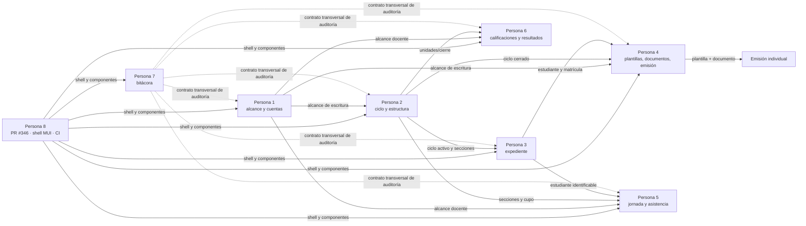
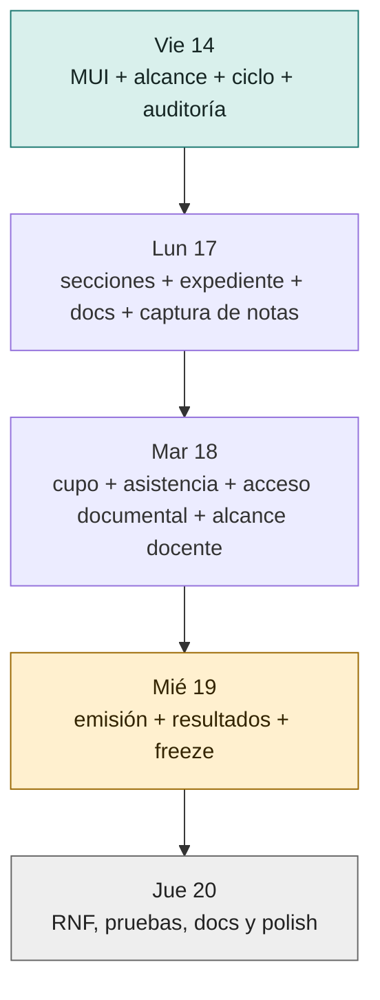

# Sprint full-stack — 14 al 20 de agosto de 2026

Este sprint entrega capacidades verticales: quien toma un carril implementa backend, frontend y
pruebas del mismo dominio. El trabajo que desbloquea a otra persona debe estar integrado en
`develop` a más tardar el miércoles 19; el jueves 20 queda reservado para trabajo que no bloquea a
nadie.

> Los wireframes de este documento son una propuesta de interacción, no un contrato visual. Deben
> reutilizar el sistema de diseño de la PR
> [#346](https://github.com/siga-inebi/siga-inebi/pull/346).

## Resultado esperado

Al finalizar el miércoles 19:

- la base MUI está integrada y cada carril entrega una experiencia completa contra el API real;
- ciclo y estructura habilitan los flujos dependientes de asistencia, evaluación y emisión;
- expediente permite consultar al estudiante y sus relaciones institucionales;
- plantillas y documentos cubren el flujo mínimo previo a una emisión;
- jornada, evaluación y bitácora exponen sus flujos principales;
- ningún cambio bloqueante queda únicamente en una rama o PR abierta.

## Acuerdos de trabajo

| Tema | Acuerdo |
|---|---|
| Propiedad | Una persona es responsable de backend, frontend, pruebas y trazabilidad de su carril. |
| Deadline | “Entregado” significa mergeado en `develop`, no solamente con PR abierta. |
| Tamaño de PR | Límite suave de 1000 líneas autoradas; no cuentan lockfiles, código generado ni snapshots. |
| Cohesión | Un PR cubre un RF o un grupo estrechamente relacionado del mismo dominio. |
| Corte vertical | Si backend y frontend no caben juntos, el mismo responsable abre dos PR encadenadas el mismo día. |
| Revisión | Las parejas 1↔8, 2↔5, 3↔7 y 4↔6 se revisan entre sí. |
| Alerta | Si un deadline está en riesgo, se reporta antes de las 12:00 con enlace a la PR y alcance pendiente. |
| Jueves 20 | Solo pruebas, RNF, documentación, trazabilidad, accesibilidad y tareas sin consumidores bloqueados. |

Antes de implementar un issue con `status:in-progress`, se compara el criterio de aceptación contra
el código actual. Esa etiqueta indica que existe base técnica; no implica que todo deba
reimplementarse.

## Responsabilidades

| Carril | Persona | Propiedad full-stack |
|---|---|---|
| Seguridad | Persona 1 | Alcances, autenticación, cuentas y sus pantallas |
| Académico | Persona 2 | Ciclo, secciones, cupos, asignaciones y sus pantallas |
| Expediente | Persona 3 | Estudiantes, encargados, contactos y sus pantallas |
| Documental | Persona 4 | Plantillas, documentos, emisión y sus pantallas |
| Asistencia | Persona 5 | Jornada, captura, presencia y sus pantallas |
| Evaluación | Persona 6 | Calificaciones, resultados y sus pantallas |
| Bitácora | Persona 7 | Auditoría, consultas restringidas y su pantalla |
| Plataforma | Persona 8 | Base MUI, integración, CI, rendimiento y accesibilidad |

## Calendario de entrega

### Viernes 14 — bases que desbloquean

| Persona | Entrega del día |
|---|---|
| Persona 1 | Gap analysis y primer corte de [#73 RF-ALC-005](https://github.com/siga-inebi/siga-inebi/issues/73). |
| Persona 2 | Backend + UI de cierre de ciclo: [#129 RF-CIC-004](https://github.com/siga-inebi/siga-inebi/issues/129). |
| Persona 3 | Gap analysis de expediente y contrato de la vista de estudiante para #185–#189. |
| Persona 4 | Backend + UI de plantilla activa: [#254 RF-PLA-007](https://github.com/siga-inebi/siga-inebi/issues/254). |
| Persona 5 | Backend + UI de presencia en tiempo real: [#212 RF-JOR-008](https://github.com/siga-inebi/siga-inebi/issues/212). |
| Persona 6 | Gap analysis de calificaciones y contrato de captura para #118–#120. |
| Persona 7 | Contrato compartido de auditoría y primer corte de [#111 RF-BIT-001](https://github.com/siga-inebi/siga-inebi/issues/111). |
| Persona 8 | Revisar e integrar [PR #346](https://github.com/siga-inebi/siga-inebi/pull/346); publicar componentes reutilizables y checklist visual. |

**Deadline duro:** la PR #346 y los contratos compartidos de ciclo, alcance y auditoría deben estar
disponibles al terminar el día.

### Lunes 17 — flujos base utilizables

| Persona | Entrega integrada en `develop` |
|---|---|
| Persona 1 | [#73](https://github.com/siga-inebi/siga-inebi/issues/73) y validación/cierre de [#106 RF-AUT-002](https://github.com/siga-inebi/siga-inebi/issues/106), incluyendo estados de bloqueo en UI. |
| Persona 2 | [#171 RF-EST-007](https://github.com/siga-inebi/siga-inebi/issues/171) y [#175 RF-EST-011](https://github.com/siga-inebi/siga-inebi/issues/175), con listado/edición de secciones. |
| Persona 3 | [#185](https://github.com/siga-inebi/siga-inebi/issues/185)–[#188](https://github.com/siga-inebi/siga-inebi/issues/188), con alta, consulta y vínculo con encargados. |
| Persona 4 | [#146 RF-DOC-001](https://github.com/siga-inebi/siga-inebi/issues/146) y [#147 RF-DOC-002](https://github.com/siga-inebi/siga-inebi/issues/147), con catálogo y vínculo documental. |
| Persona 5 | [#213 RF-JOR-009](https://github.com/siga-inebi/siga-inebi/issues/213), con porcentaje del ciclo y explicación del indicador. |
| Persona 6 | [#118 RF-CAL-001](https://github.com/siga-inebi/siga-inebi/issues/118) y [#119 RF-CAL-002](https://github.com/siga-inebi/siga-inebi/issues/119), con captura y validación de nota. |
| Persona 7 | [#112 RF-BIT-002](https://github.com/siga-inebi/siga-inebi/issues/112) y [#117 RF-BIT-007](https://github.com/siga-inebi/siga-inebi/issues/117), con detalle de asiento y atribución visible. |
| Persona 8 | CI verde, revisión prioritaria de Personas 1, 2 y 4, y smoke tests del shell compartido. |

### Martes 18 — consumir lo desbloqueado

| Persona | Entrega integrada en `develop` |
|---|---|
| Persona 1 | [#110 RF-AUT-006](https://github.com/siga-inebi/siga-inebi/issues/110) y [#142 RF-CTA-004](https://github.com/siga-inebi/siga-inebi/issues/142), con cambio y política de contraseña. |
| Persona 2 | [#172 RF-EST-008](https://github.com/siga-inebi/siga-inebi/issues/172) y [#173 RF-EST-009](https://github.com/siga-inebi/siga-inebi/issues/173), con cupo y asignaciones docentes. |
| Persona 3 | [#189 RF-EXP-005](https://github.com/siga-inebi/siga-inebi/issues/189) y cierre de cualquier gap de #185–#188. |
| Persona 4 | [#149 RF-DOC-004](https://github.com/siga-inebi/siga-inebi/issues/149) y [#150 RF-DOC-005](https://github.com/siga-inebi/siga-inebi/issues/150), con acceso y descarga controlados. |
| Persona 5 | [#85 RF-ASI-001](https://github.com/siga-inebi/siga-inebi/issues/85) y [#86 RF-ASI-002](https://github.com/siga-inebi/siga-inebi/issues/86), con captura manual/escaneo. |
| Persona 6 | [#120 RF-CAL-003](https://github.com/siga-inebi/siga-inebi/issues/120) y [#123 RF-CAL-006](https://github.com/siga-inebi/siga-inebi/issues/123), con cero explícito y alcance docente. |
| Persona 7 | [#113 RF-BIT-003](https://github.com/siga-inebi/siga-inebi/issues/113) y [#115 RF-BIT-005](https://github.com/siga-inebi/siga-inebi/issues/115), con filtros y UI de solo lectura. |
| Persona 8 | Revisión de Personas 3, 5, 6 y 7; pruebas de navegación, permisos y errores del API. |

### Miércoles 19 — cierre de lo bloqueante

| Persona | Entrega integrada en `develop` |
|---|---|
| Persona 1 | [#144 RF-CTA-006](https://github.com/siga-inebi/siga-inebi/issues/144) y [#145 RF-CTA-007](https://github.com/siga-inebi/siga-inebi/issues/145). |
| Persona 2 | [#169 RF-EST-005](https://github.com/siga-inebi/siga-inebi/issues/169) o [#174 RF-EST-010](https://github.com/siga-inebi/siga-inebi/issues/174), priorizando el que desbloquee activación real. |
| Persona 3 | [#191 RF-EXP-007](https://github.com/siga-inebi/siga-inebi/issues/191) y [#192 RF-EXP-008](https://github.com/siga-inebi/siga-inebi/issues/192). |
| Persona 4 | [#156 RF-EMI-001](https://github.com/siga-inebi/siga-inebi/issues/156), solo si ciclo, plantilla y documento ya están integrados. |
| Persona 5 | [#88 RF-ASI-004](https://github.com/siga-inebi/siga-inebi/issues/88) y [#94 RF-ASI-010](https://github.com/siga-inebi/siga-inebi/issues/94). |
| Persona 6 | Primer resultado vertical: [#255 RF-RES-001](https://github.com/siga-inebi/siga-inebi/issues/255) y su consulta en UI. |
| Persona 7 | [#116 RF-BIT-006](https://github.com/siga-inebi/siga-inebi/issues/116), con consulta/exportación restringida. |
| Persona 8 | Freeze a las 17:00: merge de PRs bloqueantes, ejecución de suite completa y registro de pendientes. |

### Jueves 20 — únicamente no bloqueante

| Persona | Cola permitida |
|---|---|
| Persona 1 | Estados de error, accesibilidad y polish de seguridad. |
| Persona 2 | [#130 RF-CIC-005](https://github.com/siga-inebi/siga-inebi/issues/130) si nadie depende de él en este sprint. |
| Persona 3 | [#190](https://github.com/siga-inebi/siga-inebi/issues/190) o [#193](https://github.com/siga-inebi/siga-inebi/issues/193). |
| Persona 4 | [#253 RF-PLA-006](https://github.com/siga-inebi/siga-inebi/issues/253), [#278 RNF-MAN-002](https://github.com/siga-inebi/siga-inebi/issues/278) o [#295 RNF-SEG-004](https://github.com/siga-inebi/siga-inebi/issues/295). |
| Persona 5 | [#215 RF-JOR-011](https://github.com/siga-inebi/siga-inebi/issues/215); no programar #214. |
| Persona 6 | Pruebas de borde y trazabilidad del corte de evaluación. |
| Persona 7 | Filtros, exportación y accesibilidad de la bitácora. |
| Persona 8 | [#269 RNF-COM-001](https://github.com/siga-inebi/siga-inebi/issues/269), [#270 RNF-COM-002](https://github.com/siga-inebi/siga-inebi/issues/270) y actualización de [#40](https://github.com/siga-inebi/siga-inebi/issues/40). |

No se programa [#168](https://github.com/siga-inebi/siga-inebi/issues/168) ni
[#214](https://github.com/siga-inebi/siga-inebi/issues/214) hasta que tengan criterios de
aceptación explícitos.

## Dependencias y bloqueos



Las flechas continuas son dependencias funcionales. Las punteadas indican un contrato compartido:
la Persona 7 no implementa las mutaciones de otros dominios, pero define y prueba la forma en que se
auditan.

### Camino crítico



### Qué hacer cuando una dependencia no llega

| Dependencia retrasada | Persona afectada | Cambio inmediato |
|---|---|---|
| PR #346 | Personas 1–7 | Implementar backend y pruebas; no crear componentes visuales alternativos. |
| Alcance #73 | Personas 2, 4, 5 y 6 | Completar lectura y validaciones; no mergear escrituras sensibles sin denegación por defecto. |
| Ciclo/secciones | Personas 3, 5 y 6 | Trabajar con fixtures y contrato publicado; no inventar identificadores temporales. |
| Expediente | Persona 4 | Completar catálogo documental; posponer el vínculo fuerte al estudiante. |
| Plantilla activa | Persona 4 | Completar documentos; no iniciar emisión sobre una selección ficticia. |
| Contrato de auditoría | Personas 1–6 | Conservar pruebas del dominio y abrir integración auditada en la misma PR antes del merge. |

## Definition of Done vertical

Un issue no se considera terminado hasta cumplir:

- [ ] Regla de negocio en servicio de dominio, no en vista, serializer o componente.
- [ ] Migración compatible con PostgreSQL, si aplica.
- [ ] API documentada y representada correctamente en OpenAPI.
- [ ] Autorización con denegación por defecto y alcance obligatorio.
- [ ] Escritura o lectura sensible auditada según el catálogo.
- [ ] Pantalla conectada al API real; no mocks en producción.
- [ ] Estado de carga, vacío, error y denegación visibles.
- [ ] Camino feliz y rechazo relevante probados en backend.
- [ ] Smoke o prueba de componente del flujo principal en frontend.
- [ ] Trazabilidad RF → código → prueba → PR actualizada.
- [ ] Suite del área y CI en verde.

## Propuesta de interfaz

Bocetos a nivel de servilleta: indican qué hay en pantalla, no cómo se ve. Sin medidas, sin
tipografía, sin colores. El detalle visual sale del sistema de diseño ya integrado.

Vista general (papel y lápiz):


Archivo fuente: [`docs/planning/assets/sprint-2026-08-14-wireframes-sketch.png`](./assets/sprint-2026-08-14-wireframes-sketch.png).

No inventar otro look. Reutilizar la receta de la [PR #346](https://github.com/siga-inebi/siga-inebi/pull/346): `AppShell` + `PageHeader` + `ListSection`/`DataTable` + overlay centrado (`FloatingWindow` / `EntityFormWindow`). Login usa `PublicShell`; el resto, el shell privado. Crear/editar/detalle van en ventana, no en un layout nuevo.

Páginas ya existentes que cada carril debe extender, no reemplazar:

| Carril | Página de partida |
|---|---|
| Persona 1 | `auth/LoginPage.jsx`, `dashboard/DashboardPage.jsx` |
| Persona 2 | `cycles/CyclesPage.jsx`, `academics/*Page.jsx` |
| Persona 3 | `students/AlumnosPage.jsx`, `enrolments/EnrolmentsPage.jsx` |
| Persona 4 | `documents/TemplatesPage.jsx` |
| Persona 5 | `attendance/AttendancePage.jsx` |
| Persona 6 | `evaluation/EvaluationPage.jsx` |
| Persona 7 | aún no hay página de bitácora; usar la misma receta de listado + detalle de solo lectura |

### Shell compartido

Misma estructura en todas las pantallas. La navegación cambia por permisos, no por carril.

```text
 .--------------------------------------------------.
 | logo        ~~~~~~~~~~~~              (usuario)  |
 |-------.------------------------------------------|
 | ~~~~  |  Titulo                        [ accion ]|
 | ~~~~  |  ~~~~~~~~~~~~~~~                         |
 | ~~~~  |  [ ~~ v ] [ ~~ v ]  [ buscar ~~~~~ ]     |
 | ~~~~  |  ~~~~~~~~~~~~~~~~~~~~~~~~~~~~~~~~~      |
 | ~~~~  |  ~~~~~~~~~~~~~~~~~~~~~~~~~~~~~~~~~      |
 | ~~~~  |  ~~~~~~~~~~~~~~~~~~~~~~~~~~~~~~~~~      |
 '-------'------------------------------------------'
```

En móvil la barra lateral se vuelve drawer, la acción primaria queda visible y cada fila muestra
primero identidad, estado y acción.

### Persona 1 — Seguridad y cuentas

```text
 .------------------------------------------.
 | Cuentas                     [ + cuenta ] |
 | [ rol v ] [ estado v ]  ( buscar ~~~~~ ) |
 | ~~~~~~~~~~~~~~~   ~~~~~~   ( activa )    |
 | ~~~~~~~~~~~~~~~   ~~~~~~   ( bloqueada ) |
 | ~~~~~~~~~~~~~~~   ~~~~~~   ( activa )    |
 '------------------------------------------'
```

Detalle de cuenta en pestañas. Cambio de contraseña y desactivación piden confirmación explícita.

### Persona 2 — Ciclos y estructura

```text
 .------------------------------------------.
 | Ciclo ~~~~  ( activo )   [ cerrar ciclo ]|
 |------------.-----------------------------|
 | secciones  | ~~~~~~~~~~   28/35          |
 | planes     | ~~~~~~~~~~   35/35  ( ! )   |
 | docentes   | ~~~~~~~~~~   12/30          |
 '------------'-----------------------------'
```

Cerrar ciclo es acción peligrosa: primero resumen de bloqueos, luego confirmación, luego resultado
auditable.

### Persona 3 — Expediente estudiantil

```text
 .------------------------------------------.
 | ( buscar estudiante ~~~~~ )   [ + nuevo ]|
 |--------.---------------------------------|
 | .----. | ~~~~~~~~~~~~~~   ( activa )     |
 | |foto| | codigo ~~~~~~ · grado ~~        |
 | '----' | datos | encargados | docs | ... |
 |        | ~~~~~~~~~~~~~~~~~~~~~~~~~~     |
 '--------'---------------------------------'
```

Salud y disciplina no salen en el resumen; viven en una sección sensible con permiso aparte.

### Persona 4 — Plantillas, documentos y emisión

```text
 .------------------------------------------.
 | plantillas | documentos | emisiones      |
 | [ tipo v ]              [ + plantilla ]  |
 | ~~~~~~~~~~~~   v4   ( activa )           |
 | ~~~~~~~~~~~~   v2   ( borrador )         |
 | [ vista previa ]  [ publicar ]           |
 '------------------------------------------'
```

Vista previa no ejecuta código dinámico ni publica. Emisión bloqueada dice qué falta: documento,
estado de ciclo o permiso.

### Persona 5 — Jornada y asistencia

```text
 .------------------------------------------.
 | fecha ~~~~  seccion ~~~~     [ escanear ]|
 | presentes ~~  ausentes ~~  tarde ~~      |
 | ~~~~~~~~~~  07:0~  ( a tiempo )          |
 | ~~~~~~~~~~  07:1~  ( tarde )             |
 | ~~~~~~~~~~   --    ( sin registro )      |
 '------------------------------------------'
```

Captura rápida, confirmación visual del estudiante e idempotencia. Un error de red no puede
parecer registro exitoso.

### Persona 6 — Evaluación y calificaciones

```text
 .------------------------------------------.
 | unidad ~~  seccion ~~  subarea ~~~~      |
 | ~~~~~~~~~~~~   [ 85 ]   ( guardada )     |
 | ~~~~~~~~~~~~   [    ]   ( sin calificar )|
 | ~~~~~~~~~~~~   [  0 ]   ( cero )         |
 | rango ~~~~ · cierre ~~~~   [ guardar ]   |
 '------------------------------------------'
```

“Sin calificar” y cero se ven distintos. El docente solo ve lo que está dentro de su alcance
vigente.

### Persona 7 — Bitácora

```text
 .------------------------------------------.
 | desde ~~~~ hasta ~~~~ [ tipo v ]         |
 | ~~~~~~~~  ~~~~~~~~~~   ( permitida )     |
 | ~~~~~~~~  ~~~~~~~~~~   ( denegada )      |
 | ~~~~~~~~  ~~~~~~~~~~   ( permitida )     |
 | solo lectura            [ exportar ]     |
 '------------------------------------------'
```

Sin editar ni eliminar. La exportación exige autorización, respeta los filtros visibles y genera su
propio evento auditable.

## Seguimiento diario

Cada persona publica antes de las 12:00:

```text
Carril: Persona N
Deadline de hoy: EN RIESGO | EN CURSO | LISTO
PR backend/frontend: <enlace>
Bloqueo recibido de: Persona N | ninguno
Bloqueo que puedo causar: Persona N | ninguno
Decisión requerida antes de: <hora> | ninguna
```

El miércoles 19 a las 17:00 se registra qué quedó integrado. Los pendientes bloqueantes pasan al
siguiente sprint; no se renombran como “polish” para introducirlos el jueves.
